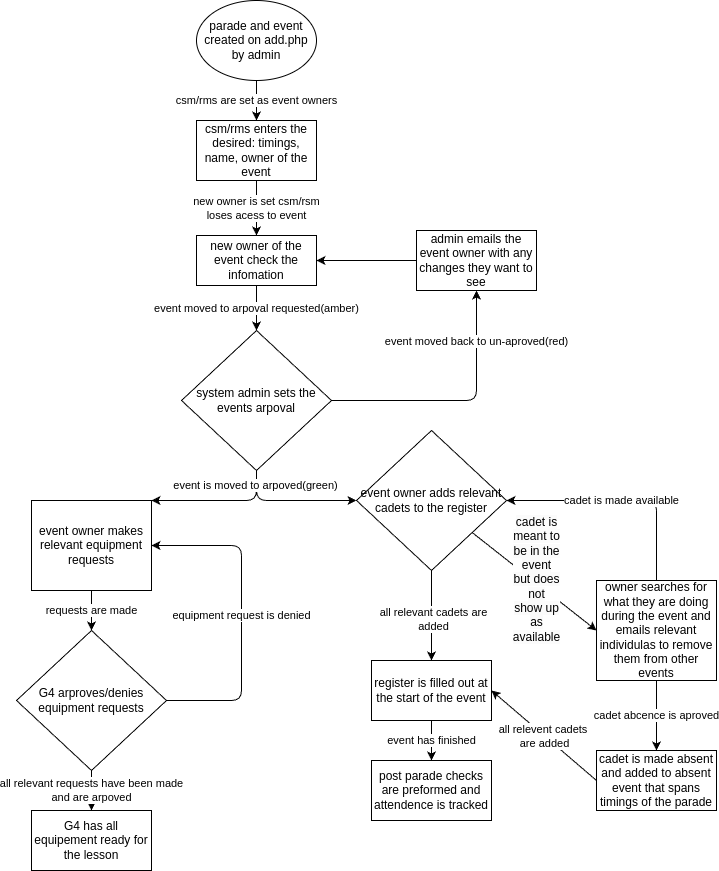

# Cadet Management System

A full-stack web application that digitises and streamlines the administration of a school cadet unit. Built as a solo Computer Science coursework project — covering requirements gathering, system design, implementation, testing, and deployment.

**Tech stack:** PHP · MySQL · JavaScript (Vanilla) · HTML/CSS · Apache

---

## Overview

The system replaces a paper-based process for managing cadet parades, lesson planning, equipment logistics, and attendance tracking. It supports five distinct user roles, each with carefully scoped server-side permissions, and provides a colour-coded calendar view of all scheduled events.

The full 224-page technical write-up — covering analysis, requirements gathering, system design, implementation, and testing — is included in this repository: [Cadet-Management-System-redacted.pdf](Cadet-Management-System-redacted.pdf)

---

## Features

- **Role-based access control** — five user roles (Admin, G4, Event Owner, Duty Cadet, Basic User) enforced server-side on every request
- **Parade calendar** — interactive calendar showing upcoming parades and their events, with forward/backward skip navigation
- **Event approval workflow** — events progress through three states (not approved → approval requested → approved), colour-coded red/amber/green
- **Attendance register** — event owners populate per-cadet attendance records (present/absent) for each lesson
- **Equipment request log** — booking system that prevents double-booking; G4 cadets approve or deny each request
- **Admin dashboard** — full CRUD for users, parades, events, and equipment inventory
- **Regex-powered search** — all live-search inputs filter results using regular expressions
- **Profile photo uploads** — users can upload and update their own profile photo
- **Automated database backup** — cron-driven shell script for nightly MySQL dumps with 7-day retention

---

## Architecture

### Page & Link Structure


### Event Approval Pipeline


### Lesson Planning Process


### Entity Relationship Diagram


---

## Database Schema

Defined in [`schema.sql`](schema.sql). Six tables with foreign key constraints throughout:

| Table | Purpose |
|-------|---------|
| `users` | Accounts with role flags (`admin`, `G4`) and active/retired status |
| `parades` | Scheduled parade dates and time windows |
| `events` | Lessons linked to a parade, with owner, duty cadet, and approval state |
| `equipment` | Inventory items with name, description, and physical location |
| `equipment_requests` | Links events to equipment; tracks approval status (requested / approved / denied) |
| `user_event` | Attendance register — links users to events with a present/absent flag |

---

## User Roles

| Role | Key Capabilities |
|------|-----------------|
| **Admin** | Full CRUD on all entities; approve events; view all parades and events |
| **G4 (Logistics)** | View all events; approve or deny equipment requests |
| **Event Owner** | Manage own events; populate the register; submit equipment requests |
| **Duty Cadet** | Monitor assigned events with the same controls as the event owner |
| **Basic User** | View own upcoming lessons on the calendar |

---

## Getting Started

### Prerequisites
- PHP 8+
- MySQL / MariaDB
- Apache (or any PHP-capable web server, e.g. XAMPP / WAMP)

### Installation

1. Clone the repository:
   ```bash
   git clone <repo-url>
   cd cadet-management-app
   ```

2. Import the database schema:
   ```bash
   mysql -u root -p < schema.sql
   ```

3. Configure the database connection:
   ```bash
   cp includes/connection.example.php includes/connection.php
   # Edit includes/connection.php with your database credentials
   ```

4. Point your web server's document root at the project directory and open it in a browser.

5. Log in with the admin account you create directly in the database, then use the Add page to set up the rest.

---

## Screenshots

**Calendar — Admin / G4 view**


**Calendar — Standard user view**


**Admin dashboard (Add page)**


**Event page — Approved event with register and equipment requests**


**Event page — Pending approval**


---

## Project Background

This application was designed, built, and documented independently from scratch. The development process covered:

- **Requirements gathering** — stakeholder interviews with NCOs to identify pain points with the existing paper-based system; questionnaire responses used to define user needs and system objectives
- **System design** — ER diagram, page-structure graphs, event pipeline flowcharts, and login-flow diagrams produced before any code was written
- **Iterative development** — built in phases, progressively refactoring toward reusability (e.g. `display_parade.php` is a shared include used by both the calendar and event pages to avoid duplicating HTML generation logic)
- **Security** — session-based authentication, SHA-256 password hashing, input sanitisation on all POST requests, role checks on every page load
- **Deployment** — hosted on a Linux server; automated nightly MySQL backups via cron with 7-day rolling retention

---

## Skills Demonstrated

- **Full-stack web development** — PHP backend, MySQL relational database, vanilla JS/CSS frontend with no frameworks
- **Relational database design** — normalised schema, foreign key constraints, composite primary keys, and junction tables
- **Role-based access control** — multi-tier permission system enforced entirely server-side
- **Problem decomposition** — complex domain logic (equipment conflict detection, event approval workflow, REGEX live-search) broken into clean, reusable functions
- **Software engineering process** — solo delivery covering the full lifecycle: analysis, design, implementation, testing, and deployment
- **Independent project delivery** — all decisions made and justified independently, from data model to UI layout

---

## License

[CC BY-NC 4.0](LICENSE-CC-BY-NC-4.0.md) — free to use for non-commercial purposes with attribution.
